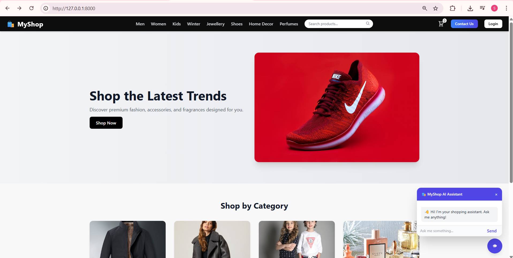

# MyShop

MyShop is a powerful, flexible Laravel-based e-commerce platform that makes online shopping seamless for customers and easy to manage for administrators. The project is built with modern web best practices and designed for extensibility.

## Features

### For Customers
- **Browse Products**: Explore products, view detailed information, and check prices.
- **Secure Ordering**: Register or log in to make purchases through a user-friendly checkout experience.
- **Discounts & Coupons**: Enter coupon codes at checkout for discounts.

### For Administrators
- **Product Management**: Add, edit, and organize products with categories and subcategories.
- **Coupon/Discount Management**: Create, assign, and manage coupons or discounts at multiple scopes (product, class, by code).
- **Sales Analytics**: View total company sales and turnover from a custom dashboard.

### Roles & Permissions
- **User**: Browse, apply coupons, and check out after logging in.
- **Admin**: Full access to product, coupon, discount, and reporting tools.

## Technologies Used

- **Backend**: PHP 8+, Laravel Framework, Eloquent ORM
- **Frontend**: Blade templating, Laravel Vite, npm
- **Database**: MySQL, PostgreSQL, or SQLite (configurable)
- **Testing**: PHPUnit

## Getting Started

Clone and launch MyShop locally with the following steps:

```bash
git clone https://github.com/siambasher123/MyShop.git
cd MyShop
composer install
npm install
cp .env.example .env
# Set up your DB credentials in .env
php artisan key:generate
php artisan migrate --seed
npm run dev
php artisan serve
```

Visit [http://localhost:8000](http://localhost:8000) to get started.

## Directory Structure Highlights

- `app/Http/Controllers/`: Request handling logic (e.g., ProductController, CartController)
- `app/Models/`: Eloquent models (e.g., Product, User, Coupon)
- `resources/views/`: Blade templates (user & admin UIs, layouts/partials)
- `routes/web.php`: Web routes (user-facing and admin dashboard)
- `routes/api.php`: API endpoints, if exposed
- `config/`: Laravel and app configuration files

## Screenshots




